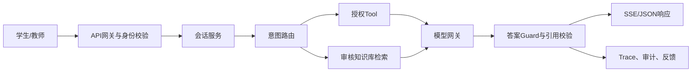

# 市级学生智能问答助手 PRD

**版本**：v1.0（立项基线）  
**状态**：Draft，需教育主管部门、学校信息中心、法务与未成年人保护负责人评审  
**适用范围**：面向全市中小学生及其授权教职工的统一智能问答服务  
**产品定位**：基于可信教育数据和市级课程知识库的学习辅助工具，不替代教师、学校管理系统或心理/医疗专业服务。

## 1. 产品结论

本产品必须按市级公共服务建设，而不是把单校聊天 Demo 直接扩容。第一版只承诺三件事：

1. 学生能安全登录并查询自己的学习数据。
2. 学生能围绕课程、考试和错题获得有依据、可解释的回答。
3. 学校和市级运营人员能审计每次回答、发现风险并及时停用能力。

任何没有数据来源、权限依据或安全策略的回答，都不能进入全市上线范围。

## 2. 背景与问题

当前学生需要在教务系统、题库、成绩报告和学习资料之间切换，常见问题包括：看不懂成绩报告、找不到薄弱知识点、不会制定复习计划、无法确认资料是否适用于当前年级。学校也缺少统一的问答入口、数据使用审计和模型风险处置能力。

现有项目具备部分学生、考试、成绩、Tool、Prompt 和聊天代码雏形，但核心链路存在 API 契约、ORM、认证、SSE、部署和测试断裂。因此本 PRD 将“可验证的公共服务能力”作为验收标准，现有代码只能作为部分领域模型和原型参考。

## 3. 目标与非目标

### 3.1 产品目标

- 为学生提供统一、低门槛的学习问答入口。
- 对成绩、考试和错题分析提供数据来源与计算过程。
- 对课程知识问答提供市级审核资料、年级和学科适配。
- 让教师、学校管理员和市级运营人员在授权范围内查看趋势和风险。
- 建立完整的身份、租户、审计、模型评估和应急停用能力。

### 3.2 第一版不做

- 不自动给学生下诊断、医疗建议或心理疾病判断。
- 不替教师进行成绩评定、处分决定、升学推荐或招生筛选。
- 不开放任意用户上传资料后直接进入全市知识库。
- 不允许模型直接执行 SQL、访问未授权学生数据或调用未登记的外部工具。
- 不承诺模型答案绝对正确；产品必须显示来源、时间和不确定性。

### 3.3 首期成功指标

这些指标是试点和全市上线的产品指标，不是开发团队可以自行修改的技术指标：

- 试点学校学生月活达到目标学校学生数的 30% 以上，连续 4 周保持稳定。
- 学生反馈“有帮助”的比例达到 70% 以上；“数据不对”反馈低于 3%。
- 有来源的事实型回答比例不低于 90%，成绩类回答可追溯率达到 100%。
- 高风险内容拦截或转人工比例不低于 99%；风险事件从识别到进入运营队列不超过 60 秒。
- 关键主流程成功率不低于 99%，学生主动重试率低于 5%。
- 教师和学校管理员能够在一个工作日内完成问题定位、下线知识内容或停用能力。

## 4. 用户与权限

系统采用“市—区县—学校—班级—学生”多租户层级。所有数据访问必须同时通过身份、角色和数据归属校验。

| 角色 | 主要能力 | 数据范围 |
|---|---|---|
| 学生 | 个人问答、查看本人考试/错题、反馈答案 | 本人及系统公开课程资料 |
| 监护人（可选） | 查看已授权未成年人学习摘要、接收安全通知 | 被授权学生 |
| 教师 | 查看所教班级/学科汇总、创建班级学习任务 | 所属学校和授权班级 |
| 学校管理员 | 管理学校用户、数据同步、内容审核、审计 | 所属学校 |
| 区县管理员 | 区县级运营、学校配置、风险统计 | 所属区县 |
| 市级运营/安全管理员 | 全市配置、知识库发布、模型策略、应急停用 | 全市，但默认脱敏 |
| 审计人员 | 只读查看审计和风险事件 | 按审计授权范围 |

角色必须来自统一身份平台或经过审批的角色绑定表，不能在登录接口中写死为学生角色。

## 5. 核心场景与用户故事

### 5.1 学生问成绩

学生问：“我这次数学为什么比上次低？”系统确认学生身份和考试范围，读取本人两次成绩、科目分项和小题统计，返回变化、证据、可能原因和下一步建议。若数据缺失，应明确告诉学生缺少哪项数据。

### 5.2 学生问错题

学生问：“我最近最需要复习什么？”系统只使用本人授权的错题和知识点统计，按丢分、频次和时间排序，给出不超过指定数量的复习建议，并允许查看原始题目或报告来源。

### 5.3 学生问课程知识

学生问一个学科概念。系统根据年级、学科和市级审核知识库回答，展示资料名称、版本和章节；无法确认年级适配时先追问，不输出未经来源支持的政策或教材结论。

### 5.4 教师查看班级趋势

教师查看班级某次考试的知识点薄弱分布。系统返回聚合数据和样本量，默认隐藏学生姓名；查看个体记录必须有明确的班级授权和审计记录。

### 5.5 风险问题

学生表达自伤、欺凌、违法、医疗或其他高风险内容时，系统停止普通学习建议，使用经过审核的安全话术，提供当地人工求助渠道，并生成最小化安全事件记录。高风险策略可由市级管理员即时停用。

## 6. 产品范围与分阶段交付

### 阶段 0：基础平台（上线前置）

- 统一身份接入、角色绑定和租户隔离。
- 学生/学校/考试/成绩数据字典和同步校验。
- 会话、消息、反馈、审计和模型调用的统一数据模型。
- API、SSE、错误码、日志和密钥管理规范。
- 离线安全评测集、回归测试和压测基线。

### 阶段 1：试点 MVP

选择 3—5 所学校、1—2 个区县试点，开放：

- 学生登录与本人数据问答。
- 课程知识问答（有限学科和年级）。
- 成绩、考试、错题三个只读 Tool。
- 流式聊天、历史会话、答案反馈和人工问题上报。
- 学校管理员审计和内容下线。

### 阶段 2：区县扩展

- 覆盖全部试点区县。
- 增加教师聚合分析、家长授权、知识库审核流程。
- 增加模型路由、降级回答、人工转接和风险运营看板。

### 阶段 3：全市上线

- 完成全市容量压测、灾备演练、隐私影响评估和第三方安全评估。
- 完成多区县数据隔离抽测、全量审计抽查和应急停服演练。
- 按学校和年级灰度发布，不允许一次性全量切换。

## 7. 功能需求

### 7.1 身份与账户

- `AUTH-001`：优先接入市级统一身份平台；本地账号仅用于开发和灾备。
- `AUTH-002`：登录后服务端签发短期访问凭证和可撤销刷新凭证，浏览器不把长期凭证放入 localStorage。
- `AUTH-003`：首次登录必须完成学校、年级和学生档案绑定；绑定冲突进入人工处理。
- `AUTH-004`：角色、学校和区县变更在下一次请求或短缓存周期内生效。
- `AUTH-005`：提供退出、撤销会话、异常登录提醒和管理员强制下线。

### 7.2 会话与聊天

- `CHAT-001`：前端只能使用服务端创建的会话 ID，不能随机生成一个未登记 ID。
- `CHAT-002`：创建会话、发送消息、读取历史、删除/归档会话均有明确接口。
- `CHAT-003`：支持流式回答、取消生成、网络断线重连和幂等消息 ID。
- `CHAT-004`：历史消息按统一字段返回：`id`、`role`、`content`、`created_at`、`status`、`sources`。
- `CHAT-005`：限制单条消息长度、单会话消息数、并发请求和每日用量。
- `CHAT-006`：回答结束必须产生可查询的 `agent_run_id`，并关联模型、Prompt、Tool、Guard 和耗时信息。
- `CHAT-007`：作业辅导默认采用分步提示、思路检查和自测模式；只有在授权的教学场景下才显示完整解析，不以自动代写为默认行为。

### 7.3 问答路由

第一版路由至少包括：

- 课程概念问答；
- 考试总分/排名变化；
- 科目成绩和趋势；
- 小题丢分和知识点薄弱；
- 学习计划建议；
- 账号、数据来源和产品使用帮助。

课程和作业辅导需要支持“讲解—追问—练习—反馈”的连续流程，系统应根据学生回答调整提示难度，并在学生明确要求时解释答案来源。

路由结果必须包含意图、置信度和允许调用的 Tool。低置信度时先澄清问题，不允许模型自行猜测学生身份、考试或年级。

### 7.4 数据 Tool

每个 Tool 必须有注册名、输入 JSON Schema、输出 Schema、权限要求、超时、只读标记和审计策略。

第一版 Tool：

- `get_exam_summary`
- `get_score_trend`
- `get_ranking_change`
- `get_question_loss`
- `get_subject_scores`
- `get_student_profile`

所有 Tool 查询必须自动带入 `school_id`、`student_id` 和授权范围，并在数据库层增加可验证的归属约束。Tool 失败时只返回稳定错误码和用户可理解的提示，内部堆栈只写服务端日志。

### 7.5 知识库与引用

- 知识文档必须有来源单位、适用年级、学科、版本、发布日期、审核人、状态和失效时间。
- 草稿、审核中、已发布、已下线状态分离；只有已发布内容可被线上模型检索。
- 每个事实型回答显示来源卡片；来源不足时显示“无法从已审核资料确认”。
- 上传、切片、向量化、发布和下线均产生审计记录。

### 7.6 答案安全与反馈

- 检查个人隐私泄露、跨学生信息、敏感内容、越权数据、危险建议和不当措辞。
- 对数值回答执行来源校验；回答中的成绩、排名和日期必须可追溯到 Tool 结果。
- 学生可标记“有帮助/没帮助/数据不对/表达不当/其他”，并附可选说明。
- 运营人员可查看风险事件、停用 Prompt/Tool/知识文档或切换到保守回答模式。

## 8. AI 系统要求

系统采用“确定性数据 Tool + 审核知识库 + 受控模型”的组合，模型不得直接访问数据库。



模型网关必须具备：超时、有限重试、供应商 fallback、熔断、模型版本记录、Token/成本记录和人工关闭开关。模型、Prompt 和知识库版本必须随每次回答固化，保证能够复盘。

回答策略：

- 学习数据问题优先使用 Tool，不允许凭模型记忆编造数字。
- 知识问题优先检索已发布资料，并给出来源。
- 无法确认时明确说明限制并追问必要条件。
- 不输出诊断、医疗结论、处分建议、招生筛选或对学生人格的判断。

## 9. 数据模型与数据治理

核心实体至少包括：`city`、`district`、`school`、`class`、`user`、`role_binding`、`student_profile`、`exam`、`subject`、`score`、`question_score`、`knowledge_document`、`chat_session`、`chat_message`、`agent_run`、`tool_call_log`、`model_usage_log`、`prompt_version`、`feedback`、`safety_event`、`audit_log`。

关键约束：

- 所有学生数据带学校归属；学生、考试、成绩的学校关系必须有复合外键或等价数据库约束。
- 查询层和数据库层同时实施租户隔离，不能只依赖 UUID 不相同这一事实。
- 原始成绩、聊天内容、审计数据和模型日志分级存储，最小权限访问。
- 生产库只通过正式迁移创建；空库迁移、升级迁移、回滚策略和备份恢复必须在 CI 中验证。
- 默认不永久保存完整聊天内容；保留周期、删除请求和脱敏规则由教育主管部门与法务确认。

## 10. API 规范

统一前缀为 `/api/v1`，错误结构统一为：

```json
{
  "error": {
    "code": "SESSION_NOT_FOUND",
    "message": "会话不存在或无权访问",
    "request_id": "...",
    "details": {}
  }
}
```

核心接口：

| 方法 | 路径 | 用途 |
|---|---|---|
| `POST` | `/auth/login` | 登录 |
| `POST` | `/auth/refresh` | 刷新凭证 |
| `POST` | `/auth/logout` | 撤销会话 |
| `GET` | `/me` | 当前身份与授权范围 |
| `POST` | `/chat/sessions` | 创建会话 |
| `GET` | `/chat/sessions` | 获取本人会话列表 |
| `GET` | `/chat/sessions/{id}/messages` | 获取历史消息 |
| `POST` | `/chat/sessions/{id}/messages` | 发送非流式消息 |
| `POST` | `/chat/sessions/{id}/stream` | 发送流式消息 |
| `POST` | `/chat/messages/{id}/feedback` | 提交答案反馈 |
| `GET` | `/admin/audit/events` | 授权审计查询 |

SSE 每个事件使用标准 `event:` 和 `data:`，事件至少包括 `message_start`、`answer_chunk`、`source`、`answer_complete`、`error`、`done`。前后端必须共享事件 Schema，并有契约测试覆盖半包、重连和错误场景。

## 11. 前端体验

- 首页先显示当前学生身份、学校和数据更新时间。
- 新用户进入后由服务端创建会话，不显示无意义的随机 ID。
- 消息区展示回答、来源、数据时间、免责声明和反馈入口。
- 支持会话列表、新建、重命名、归档、加载历史、重试、取消生成和断线恢复。
- 对数据缺失、无权限、模型繁忙和安全转人工分别给出不同提示。
- 支持键盘操作、屏幕阅读器、移动端布局和减少动画模式。
- 不在页面展示固定测试账号、默认密码或内部异常。

## 12. 安全、隐私与未成年人保护

上线前必须完成隐私影响评估、数据分级、权限评审和安全测试。具体法律适用由主管部门和法务确认，至少覆盖个人信息保护、未成年人保护、网络与数据安全、教育数据管理和内容安全要求。

技术要求：

- 生产环境禁止默认密钥、硬编码密码和开发模式热重载。
- 密钥放入专用密钥管理系统，镜像不能包含 `.env`、Token 或测试数据。
- 浏览器优先使用同源、Secure、HttpOnly、SameSite Cookie 或等价 BFF 方案。
- 所有管理接口必须有认证、RBAC、租户范围和审计。
- API、SSE、登录、搜索和反馈均实施限流、防重放和请求大小限制。
- 传输使用 TLS；数据库、备份和敏感日志加密；日志不得记录密码、完整 Token 或不必要的学生明文信息。
- 对未成年人高风险内容启用更严格的回答和人工升级策略。
- 建立数据泄露、模型异常、错误数据和大规模滥用的应急响应流程。

## 13. 部署与运维

生产拓扑至少包含：API 网关、Web、API 服务、异步 Worker、PostgreSQL、Redis、对象存储/知识库、日志与监控、密钥管理和备份系统。Nginx 或网关必须正确支持 SSE：HTTP/1.1、关闭响应缓冲、长读取超时和连接数限制。

目标：

- 可用性：试点月度 99.5%，全市上线月度 99.9%。
- RPO ≤ 5 分钟，RTO ≤ 30 分钟。
- 发布支持灰度、回滚、数据库迁移前检查和配置版本化。
- 每日备份并每月执行恢复演练；备份恢复结果进入审计记录。
- 监控登录成功率、聊天成功率、SSE 中断率、模型错误率、Tool 错误率、P95 延迟、Token 成本和安全事件。

容量按以下基线进行第一次压测：100 万注册学生、10 万日活、峰值 1 万并发在线、聊天发起峰值 100 req/s。实际城市规模发生变化时，应在压测前重新核算，而不是直接套用该数字。

## 14. 测试与验收

### 14.1 必测测试

- 单元测试：权限判断、租户过滤、Tool Schema、Prompt 渲染、Guard、错误码。
- 集成测试：真实 PostgreSQL 迁移、认证、会话、成绩查询、审计写入。
- 契约测试：OpenAPI、SSE 事件、前后端字段、错误结构。
- E2E：登录—创建会话—发送问题—流式回答—查看来源—反馈—刷新页面。
- 安全测试：越权、跨学校读取、Token 重放、限流、注入、敏感信息泄露。
- 性能测试：并发 SSE、模型超时、Redis/PostgreSQL 故障、降级和恢复。
- 内容评测：按年级/学科/风险类型维护离线评测集，并对每次模型或 Prompt 发布回归。

### 14.2 首次上线门槛

- P0 缺陷为 0，P1 缺陷有明确豁免和负责人。
- 关键 API、权限和 SSE 契约测试全部通过。
- 试点数据抽测跨学校泄露为 0。
- 成绩类回答 100% 能回溯到数据 Tool；知识类回答达到既定引用覆盖率。
- 高风险测试集无“直接给出危险建议”的阻断级失败。
- 压测达到容量基线，故障演练完成，备份可恢复。
- 学校管理员、教师和学生分别完成可用性验收。
- 试点产品指标达到第 3.3 节门槛，并连续观察 7—14 天后才能扩大范围。

## 15. 项目实施建议

### 15.1 现有项目可复用

- 学生、考试、成绩、题目和诊断领域模型的业务概念。
- Tool Registry、Prompt 版本、Response Guard、Trace 的设计意图。
- React 基础页面和 Docker 构建思路。

### 15.2 必须重做或先对齐

- 身份、RBAC、学校/区县/市级租户隔离。
- Chat/SSE/session API 契约和前端状态流转。
- ORM、Alembic、模型导入和测试数据库的一致性。
- AgentLoop、模型 Provider、Tool Schema 的单一接口。
- Prompt/Trace/Guard 主链路接入和审计闭环。
- Compose、生产镜像、密钥、Nginx、Worker、备份恢复和 CI。

### 15.3 建议团队配置

至少需要产品经理 1 名、后端 2—3 名、前端 1—2 名、数据/知识库 1—2 名、AI 评测 1 名、测试 1—2 名、运维安全 1 名，以及教育业务和未成年人保护代表。市级上线不能由单一开发者以“容器能启动”作为验收。

## 16. 主要风险与决策点

| 风险 | 处理方式 |
|---|---|
| 成绩数据质量不一致 | 建立数据字典、同步校验、更新时间和缺失状态；模型不得补猜 |
| 多租户越权 | 复合约束、统一授权中间件、越权自动化测试和审计抽查 |
| 模型幻觉或不当建议 | Tool/RAG 优先、来源校验、Guard、离线评测、人工升级 |
| 成本失控 | 用量配额、模型分级、缓存、超时、预算告警和按学校统计 |
| 高峰访问拥塞 | SSE 连接池、异步队列、限流、降级回答和容量压测 |
| 学校接受度低 | 试点共创、教师反馈、学生可理解的解释和明确的数据时间 |
| 现有代码继续漂移 | 从本 PRD 生成 API/数据契约，禁止以未测试的旧文档宣称完成 |

## 17. 立项后第一周交付物

1. 经过评审的角色权限矩阵和数据分级表。
2. OpenAPI、SSE 事件 Schema 和统一错误码。
3. PostgreSQL 全新库迁移脚本及学校隔离测试。
4. 一条可通过自动化测试的学生主流程：登录 → 创建会话 → 提问 → 获得带来源回答 → 反馈。
5. 试点学校、数据负责人、模型供应商、应急联系人和上线回滚方案清单。

在这五项交付物通过前，不进入“全市上线开发”，只进行隔离环境的原型和评测。
