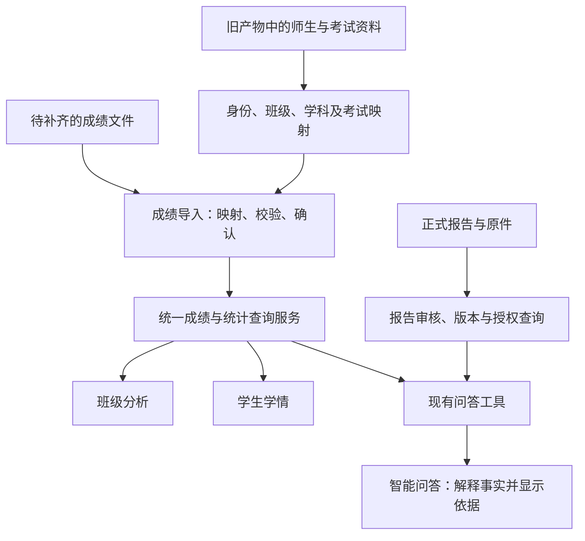

# 教务与教学分析五模块：智能问答对接方案

日期：2026-09-19  
范围：师生班级与考试、成绩导入、班级分析、学生学情、正式报告原件，以及与现有学生智能问答的对接。  
性质：供经理确认范围、业务开发拆任务、问答同事联调的方案。本次只核对本地资料、源码和 SQL 备份，未修改业务代码、执行迁移或导入数据。

## 1. 建议确定的交付目标

这五块负责把学校数据整理成可信、可查询、可追溯的业务事实。智能问答通过已有工具读取这些事实，再向学生解释。

建议一期验收目标定为：**同一学生、同一考试、同一学科、同一数据版本，在成绩页面、教师学情页面和智能问答中得到一致的结果；每个回答能找到对应成绩记录或正式报告。**

业务关系如下：

一期在现有 React、FastAPI、PostgreSQL 和问答工具上增量完善。试卷拆题、题库生产、自动批阅、教材 RAG 不列入这次五模块主任务；小题分析需要时，消费题库同事提供的题目版本和知识点映射。

## 2. 当前基础与真实数据核对结果

### 2.1 当前项目已有基础

| 模块 | 当前源码中已有的能力 | 本轮方案要解决的问题 |
|---|---|---|
| 师生班级与考试 | `/admin/school`；班级、学生、教师账号、任教、学科、考试科目及满分 | 接入旧档案、处理空学号、教师身份映射、历史班级归属和考试数据质量 |
| 成绩导入 | `/admin/imports`；八类固定 CSV、字段映射、预检、确认、事务导入、回执 | 提供面向学校的简化导入方式，补真实文件适配、缺考语义、成绩更正和发布口径 |
| 班级分析 | `/admin/analysis`、`/teacher/analysis`；人数、均分、分布、前次对比、知识点失分 | 当前按学生现有班级统计；需要确定历史考试归属、样本完整性和跨考试比较口径 |
| 学生学情 | 管理员/教师学生列表与详情，学科成绩和小题丢分 | 完善考试与学科筛选、趋势、数据完整性、分页，以及与学生端同源查询 |
| 正式报告原件 | `/admin/reports`；上传、学生/考试/学科关联、版本、摘要、原文、受权原件 | 真实报告尚缺；需要明确发布、撤回、报告类别、精确引用和问答可解释的内容 |
| 智能问答 | 学生本人身份、考试/学科选择、六个查询工具、来源持久化、依据回读 | 补齐数据可用状态和版本契约，验证报告学科/类型/版本匹配，完成真实数据联调 |

以上是本次静态核对。2026-09-18 的既有验收材料记录了隔离环境和合成数据测试，不能据此认为真实学校数据已经接通或业务环境已经部署完成。

### 2.2 “旧产物”中实际发现的数据

主要盘点对象是 `旧产物/00-备份文件/backup_before_new_question_bank_20260820_113632/qa_assistant_db.sql`，并与旧代码目录内 2026-08-18、2026-08-19 两份备份交叉核对。统计来自 SQL 中实际记录，未执行其中任何 SQL。

| 数据对象 | 2026-08-20 备份记录数 | 可用性说明 |
|---|---:|---|
| 学生 `students` | 1,743 | 其中 1,740 条未删除且为 active；按学校、年级、班名组合得到 32 个班级 |
| 教师 `teachers` | 157 | 其中 155 条未删除；旧用户关联需要映射到新账号 |
| 任教关系 `teacher_classes` | 495 | 其中 491 条未删除；需要核对班级、学科和任教有效期 |
| 考试 `exams` | 18 | 含 QA/回归测试等名称；13 条缺考试日期，全部为 upcoming，不能直接按正式已完成考试使用 |
| 考试学科 `exam_subjects` | 17 | 可作为学科、试卷和满分映射线索；不代表有成绩 |
| 学科成绩 `scores` | 0 | 当前三份备份都没有成绩记录 |
| 小题得分 `score_details` | 0 | 当前三份备份都没有小题得分记录 |
| 成绩统计 `score_stats` | 0 | 当前三份备份都没有统计记录 |
| 分析报告 `analysis_reports` | 0 | 当前三份备份都没有报告记录 |
| 报告分块 `report_chunks` | 0 | 没有可用于报告解释的正文分块 |
| 题目 `questions` | 313 | 其中 71 条未删除；仅能作为原题关联线索，不代表学生作答结果 |

文件层面，在旧产物目录检索到的 `.csv`、`.xlsx`、`.xls` 文件数均为 0；`旧产物/09-旧代码/data/reports` 目录为空。存在试卷图像、题目切片和 PDF，不能据此当作学生成绩或正式学情报告。

这些结论只覆盖当前本地归档，不能推断旧系统现行数据库没有成绩，也不能把全部旧记录直接认定为正式业务数据。

### 2.3 接入前必须处理的具体问题

1. **空学号会阻断现有导入。** 1,740 条未删除学生的 `student_no` 全部为空，当前 CSV 校验和学生新建表单要求非空学号。建议允许来源明确的旧学生先以旧 ID 建立档案，学号为空时显示“待补充”；业务层、校验层和数据库写入统一把空值处理为 NULL，不把空字符串或随意生成的数字当学号。
2. **优先使用旧学生 ID 映射身份。** 未删除学生的 `account`、`exam_no`、`entrance_exam_no` 在该快照内有值且唯一，可作为匹配候选；它们的业务含义、有效期须核实，不能自动改名为学号。`registration_no` 并不唯一，不能单独用于合并。禁止仅按姓名绑定。
3. **班级来自字段组合，缺独立班级主表。** 需要先生成稳定班级映射，再维护学年/学期和学生班级历史。不能仅凭“1班”识别班级，也不能用备份日期推断学生当时所属学年。
4. **教师关系需要核对后生效。** 未删除任教关系中，46 条年级/班名组合未匹配当前学生名册，可能涉及其他范围或测试记录，先列为待核对；另有空学科和乱码学科值，需结合班主任标记、字典和来源核实。空学科不能自动解释为全学科权限。
5. **考试档案混有测试记录。** 业务考试需列入明确清单，核对日期、年级、学科和满分。测试、缺日期、待确认记录保留为归档或待处理，不进入学生“最近考试”。
6. **编码要先识别。** 2026-08-20 备份为 UTF-16，另外两份为 UTF-8；应先规范编码，再做字段清洗。三份备份共同学生 ID 的姓名、学校、年级、班名、账号字段比较一致，不能简单把 UTF-16 当损坏文件。
7. **旧报告类型与新报告类型含义不同。** 旧 `analysis_reports.report_type` 区分年级/班级/学科范围，新系统区分诊断/成绩报告/批阅文件，并绑定学生。将来补到旧报告时必须同时识别“报告对象范围”和“内容类型”，不能把班级报告自动当成个人诊断。

由此，一期可以先推进师生与考务接入；成绩分析和报告解释的真实验收依赖补到对应文件或旧系统导出。

## 3. 五个模块分别怎么做

### 3.1 师生班级与考试：把身份和考试范围建准

**页面组织：** 保留现有六个页签，增加导入来源、账号绑定状态、待核对项和历史归属入口。

| 对象 | 一期业务要求 | 提供给问答的结果 |
|---|---|---|
| 学生 | 旧 ID 映射、在籍状态、班级归属、账号独立绑定；重名可区分 | 登录账号唯一定位到本校学生；账号未绑定时明确提示 |
| 教师 | 旧教师档案与新账号匹配；任教班级、学科、起止时间 | 教师查询服务能校验任教范围；不自动开通学生问答代理能力 |
| 班级 | 学校、学年/学期、年级、班名；转班/升学留历史 | 历史考试按考试时归属查询，避免转班改变旧统计 |
| 学科 | 统一代码、标准名称、旧名称别名 | 页面选定学科与工具取数使用同一个 ID |
| 考试 | 名称、时间、年级、学科、满分、成绩可见状态 | 明确“最近可查询考试”，只返回本人有已发布数据的考试 |

考试本身的启用状态与成绩发布状态分开：考试存在、正在考试、导入完成，均不自动等于成绩可向学生展示。旧考试缺日期时进入待核对列表，不用创建时间代替业务考试日期。

**完成标准：** 导入档案后能够定位具体学生、班级和任教关系；学生绑定正确账号；同名、同班名、毕业、停用、转班均不串数据。

### 3.2 成绩导入：从文件形成可追溯的正式事实

**操作流程：** 选择学校内已有考试和学科 → 上传文件 → 选择模板/映射列 → 预览与校验 → 确认导入 → 管理员核对 → 发布可查询版本 → 查看回执。

建议在现有八类 CSV 技术入口之上，增加“总成绩、学科成绩、小题得分”业务入口。学校和考试等已存在资料由服务端补入标准导入计划，继续复用同一个事务写入内核。

- 一期保留标准 CSV；取得实际 Excel 样本后再确定列结构、合并表头、工作表和公式值处理。若学校只能提供 Excel，把该格式适配排入一期，避免要求学校反复手工改表。
- 预检分清学生无法匹配、考试/学科不明、重复记录、超出满分、非法数值、总分与分项不一致、未配置满分等问题，定位到文件/工作表/行/列。
- 缺考、未录入、未评分、有效零分分别保存和展示。缺考不能写成 0 分参与平均值；补考或更正需有明确规则。
- 同一内容重复提交返回原回执；同批次号不同内容报冲突；已发布成绩更正产生新修订和变更说明，不静默覆盖历史依据。
- 发布后，成绩页、分析页和问答查询可见版本统一切换，相关缓存失效。问答历史保留回答时的事实快照。
- 保留现有单批 5 MB/5,000 行限制作为起点。全校小题得分可能超限，按考试/班级规划子批次，保证同一学生同一场考试学科的必要数据不被拆成半份；完整性对账完成前不发布整场结果。
- 回执单列：成功/失败/未变化记录数、未匹配学生数、缺成绩人数、账号未绑定人数、当前数据版本和发布时间。

**完成标准：** 导入后的数字与原表一致；重复导入不增记录；错误批次不留下部分正式成绩；更正后的新查询更新、历史回答可追溯。

### 3.3 班级分析：先把统计口径解释清楚

**页面组织：** 顶部学年/年级/班级/考试/学科筛选；中间显示应考、实考、缺考、有效成绩数、均分和分布；下方显示学生列表、小题失分及有依据的知识点统计。

| 口径 | 建议规则 |
|---|---|
| 样本量 | 应考人数来自考试名册或已确认归属；实考及有效成绩人数来自考试状态与成绩。仅有成绩文件时，不能把已导入行数称为全班应考人数 |
| 平均分 | 有效成绩之和 / 有效成绩人数；有效 0 分参与，缺考/未录入不参与 |
| 得分率 | 得分 / 该考试学科满分；满分未知时显示未知 |
| 及格/优秀 | 阈值由学校配置并展示；现有 60%/80% 分段可保留为“分数段”，不擅自称为全校统一及格/优秀标准 |
| 排名 | 优先使用来源明确的正式排名；系统计算时须有完整且确定的比较群体，明确并列规则。抽样数据不能生成“年级正式排名” |
| 前后变化 | 明示两次考试、样本量、满分和科目范围；可显示分数/得分率差异，但满分相同不代表难度相同，不能直接归因为教学效果 |
| 知识点失分 | 必须有小题得分与可靠标签映射；显示覆盖率及未映射数。多标签可能重叠，不能将各标签失分直接相加为总失分 |
| 历史班级 | 优先按考试时班级快照；历史信息缺失时清楚标注当前归属口径，不伪装历史统计 |

班级列表下钻到学生详情时带上考试和学科筛选。教师只读取其有效任教范围，学校管理员读取本校范围。

**完成标准：** 抽取一个完整班级，逐项人工核算均分、人数、分布和失分；页面、接口结果一致，教师访问非任教范围被拒绝。

### 3.4 学生学情：以学生为中心串起事实

**页面组织：** 学生身份与班级 → 考试/学科筛选 → 成绩与趋势 → 小题得分/失分 → 可用报告与数据来源。

一期完善以下体验：

- 列表按班级、考试、学科和数据完整性筛选；服务端分页，避免学生量增加后只显示固定截断结果。
- 详情明确成绩所属考试、学科、满分、排名群体、数据更新时间和来源批次。
- 趋势使用选定截止考试和相同学科；总分趋势额外核对科目组合，不能把单科成绩当作总分。
- 缺小题、缺原题、缺知识点、缺报告分别显示，已有学科成绩仍可正常查询。
- 学生自己的学情页可携带考试/学科或报告范围进入问答。教师查看学生详情继续使用管理查询接口，不能借“去问答”进入该学生身份会话。
- “小题失分事实”和“正式诊断结论”分开呈现。有成绩不代表有诊断，不能由低分自动生成“粗心”“基础薄弱”等结论。

**完成标准：** 同一学生的后台详情、学生成绩页和问答数值一致；切换考试/学科不串范围；教师详情只显示其被授权学科。

### 3.5 正式报告原件：明确谁的哪份报告能被解释

**操作流程：** 上传 PDF/图片等原件 → 绑定学生、考试、学科、类型 → 填写/核对原文与摘要 → 确认发布 → 学生受权查看和提问 → 新版本或撤回。

一期需要固定以下规则：

- 原件、摘要、结构化结论、报告版本一一对应。只有原件图片而没有可靠文字时，可预览原件；问答明确缺少可解释文本，待人工录入或核对 OCR 后再开放相应解释。
- 保留来源、报告生成时间、录入/确认人、文件哈希、版本和发布状态；替换文件产生新版本。
- 当前实现“保存即生成正式记录”，建议补发布确认和撤回规则。上传中、待确认、已撤回报告不进入问答可用列表；具体状态名在联调契约中统一。
- 问答按明确的报告 ID、版本、学科和类型读取。未指定报告且存在多份候选时先让用户选择，不能跨科目取最新一份代答。
- 问答可解释的结论范围来自已核对摘要/结构化内容/正文。若本期只对接摘要，就明确解释范围为摘要，不能声称已经通读原件。
- 延续当前本人范围和诊断权益校验，页面、工具、下载采用同一规则。教师目前没有报告原件管理权限；需要新增时独立定义授权。
- 班级/年级报告先作为对应管理范围资料处理，后续确有需求再增加专门支持；不得关联到随机学生。

**完成标准：** 问答所引报告可打开对应原件和版本；选定数学报告不会读取英语报告；新版本发布或权益撤销后，新请求按新状态处理。

## 4. 与智能问答怎么对接

### 4.1 责任边界

| 工作 | 五模块业务侧负责 | 智能问答侧负责 | 双方共同确认 |
|---|---|---|---|
| 数据 | 来源接入、身份映射、数据质量、版本与发布 | 读取可用数据，不自行补造缺失事实 | 字段含义、可用状态、考试/学科范围 |
| 计算 | 得分率、均值、排名规则、差值、丢分等确定性计算 | 根据工具结果组织语言 | 页面与回答同源、同口径 |
| 权限 | 后端按学校、本人、任教范围及报告权益过滤 | 传递服务端可信身份，处理无权状态 | 每个工具都重新校验访问范围 |
| 来源 | 提供记录 ID、批次/版本、更新时间、报告原件关系 | 保存回答所用事实与依据，展示可点击来源 | 原数据更正后历史引用如何解释 |
| 异常 | 区分未导入、未发布、缺项、无权、不可比 | 给出对应说明或补充选择 | 稳定状态/错误码和用户文案 |

建议复用现有业务服务层：页面 API 和问答 Tool 调用相同的查询/计算逻辑。不能由页面、Tool、模型各维护一套平均分或排名算法。

### 4.2 优先复用已有六个工具

| 用户问题 | 现有工具 | 业务侧需要提供的事实 |
|---|---|---|
| “这次考试总分、排名是多少？” | `get_exam_summary` | 可用考试、总分、满分、排名及比较人数；缺总分时明确缺失 |
| “这次数学考多少？” | `get_subject_scores` | 选定考试和学科的成绩、满分、来源 |
| “我的排名变了吗？” | `get_rank_change` | 明确两次考试、相同范围的排名、比较群体与差值 |
| “最近几次数学成绩怎么样？” | `get_score_trend` | 按考试日期排序的可用成绩；以选定考试为截止范围 |
| “这次哪几题丢分多？” | `get_question_losses` | 小题得分、满分、丢分、题号，可靠时附题目版本 |
| “帮我解释这份报告。” | `get_diagnosis` | 本人受权的指定正式报告、版本、学科、类型及已核对内容 |

本次源码核对发现，`get_diagnosis` 当前按考试过滤后取最近报告，未按传入学科过滤，也没有指定报告版本的读取参数。这个点应作为一期联调任务，避免报告页面与问答内容错配。

当前聊天 API 面向学生本人。教师“分析我们班”的自然语言问答若被纳入后续范围，应另建教师查询上下文和班级聚合工具；不能把教师请求塞入学生 `ToolContext`，也不能把浏览器传来的学生 ID 当授权。

### 4.3 双方先定一页数据契约

以下为拟补齐的契约，不表示当前接口已经全部具备：

| 类别 | 最少约定 |
|---|---|
| 身份 | 服务端确定 `school_id`、`user_id`、`student_id` 或教师授权范围；不由模型决定 |
| 查询范围 | 考试 ID、学科 ID、可选报告 ID/版本；趋势的起止考试；比较群体 |
| 数据状态 | 有数据、部分缺失、未导入、未发布、无权、不具可比性；数值空缺与零值严格区分 |
| 事实 | 原始成绩与后端计算值；单位、满分、人数、排名范围 |
| 来源 | 业务记录 ID、来源系统、导入批次、数据修订、更新时间；报告 ID/版本和原件关系 |
| 质量说明 | 缺考/缺项人数、样本覆盖、知识点映射覆盖；哪些结论不可得出 |
| 变化处理 | 发布/更正成功后刷新查询与缓存；历史答案保存当时事实；重新打开依据再校验权限 |

已有 `ToolResult` 的成功标记、事实、证据列表和错误码继续保留，新增内容按兼容方式扩展。

报告撤回或权益撤销后，不仅要核对下载权限，也要约定历史聊天中已保存报告内容的回读规则；页面、依据卡和历史接口必须一致。成绩更正通常保留历史回答并提示存在更新版本。

## 5. 真实数据接入顺序与字段映射

### 5.1 建议采用一次受控快照作为首批接入

先固定一个备份版本和业务范围，建立记录清单与来源哈希，清洗后输出标准接入数据；复用现有导入服务和来源映射。不要同时把三份备份作为三批新学生导入。

当前旧快照接口只支持考试、试卷、题目、报告和成绩，尚不支持师生主数据直接接入；旧档案接入需补转换与校验，并复用师生领域服务。新系统只保存新账号映射，不搬运旧登录密码、模型凭据等无关配置。

顺序建议：学校/学科 → 班级 → 学生档案 → 教师与任教 → 账号绑定 → 正式考试与科目 → 成绩 → 报告 → 联调对账。

### 5.2 关键映射

| 旧数据 | 新系统落点/处理 | 注意事项 |
|---|---|---|
| `students.school_no/school_name` | 学校外部标识与本校主记录 | 本次学生样本只有一个学校身份组合，不能当作多校数据验收 |
| `students.id` | 学生外部 ID 与稳定的新学生 ID | 结合来源系统和学校保持唯一；姓名只用于核对 |
| `students.grade/class_name` | 班级映射与归属历史 | 当前快照可得到 32 个组合，学年/学期仍需确认 |
| `students.user_id`、`teachers.user_id` | 旧账号与新账号的映射 | 旧整数 ID 不能直接当新 UUID 或已验证登录绑定 |
| `teacher_classes` | 教师—班级—学科—有效期 | 班主任与任课关系分别处理；历史关系不能无期限自动激活 |
| `exams` | 考试档案及来源记录 | 日期、状态、学校范围、测试标记需先核对 |
| `exam_subjects` | 学科字典 + 考试学科关系 | 旧学科可能只有名称；先规范代码/别名，再关联满分 |
| `scores.total_score` | 学生学科成绩 | 旧行通过 `exam_subject_id` 关联单个学科；字段叫 total_score 也不能当作全科考试总分 |
| `score_details` | 小题成绩 | 按学生、考试、学科、题号及必要的试卷版本识别；丢分由后端校验/计算 |
| 旧报告及文件 | 报告对象范围、内容类型、正式版本与私有原件 | 先确认是个人、班级还是年级报告，再选择接入路径 |

全科总分优先接正式来源；如果需要由学科分合计，必须先确认计入科目、赋分方式、缺考处理和数据完整性，并标明计算来源。不能把已有几科直接相加后冒充完整总分。

### 5.3 首批闭环样本

建议先选 **1 所学校、1 个完整班级、1 门学科、1 场真实考试**，对齐名册、学科成绩和小题成绩；再补同范围第 2 场考试验证趋势和比较。报告至少提供 1 份可核对的个人正式报告，报告权限用例另行覆盖。

当前可先整理师生档案、映射规则、页面和接口契约。真实成绩/报告验收还需以下材料：

- 与现有学生可匹配的成绩导出及字段说明；至少包含稳定学生标识、考试、学科、分数和满分。
- 小题得分明细、题号/试卷对应关系；需要知识点分析时同时提供可靠标签。
- 应考名单及缺考/补考/未评分规则；要展示正式排名时提供排名范围与规则。
- 正式报告原件、对应学生/考试/学科、摘要或正文、版本、允许开放范围。
- 学年学期、教师任教有效期，以及旧业务考试与测试考试的确认清单。

缺少这些材料时，可以验证缺数据提示和技术流程；对应真实业务能力标为待验收。

## 6. 实施拆分与顺序

| 顺序 | 工作包 | 主要产出 | 进入下一步的条件 |
|---|---|---|---|
| P0-A | 数据盘点与契约冻结 | 来源清单、身份映射、考试清单、字段字典、统计规则、问答契约 | 空学号、任教范围、成绩来源和报告类别有明确处理方式 |
| P0-B | 师生考务与账号接入 | 可查询档案、稳定 ID 映射、账号绑定、任教范围、历史班级规则 | 首批学生能用正确身份查询，教师范围正确 |
| P1-A | 成绩接入和发布 | 实际文件模板、预检、确认、数据版本、回执、对账结果 | 一个完整班级的真实成绩可查询且与原表一致 |
| P1-B | 班级分析与学生学情 | 统一统计服务、筛选/分页、趋势、完整性提示 | 页面人工核算通过，与问答工具结果一致 |
| P1-C | 报告与问答联调 | 报告版本/状态、精确选择、来源定位、异常说明 | 回答可回到对应事实或原件，权限与撤回用例通过 |
| P1-D | 联合验收与交接 | 验收记录、残留问题、数据更新操作说明 | 五模块和问答同事共同确认代表性用户旅程 |

排期参考：在复用现有实现、1 名业务开发主责、问答同事配合联调和有测试支持的前提下，可先按 **3–4 周**安排首批闭环。第一周侧重契约与身份，第二周成绩与对账，第三周分析/报告/问答，第四周用于联合验收与必要修正。此为粗估，待真实样本和接口差异确认后细化；等待数据的时间、复杂 Excel 适配、教师问答扩展和全校容量优化单独估算。

## 7. 一期验收清单

| 场景 | 应验收的结果 |
|---|---|
| 同名学生、空学号、旧 ID 相同但来源/学校不同 | 正确区分身份；不按姓名误合并；缺学号不伪造 |
| 旧档案重复接入 | 学生、班级、教师不重复；返回可追溯回执 |
| 成绩正确/错误/重复/更正导入 | 正确落库；错误可定位且事务回滚；重复不增量；更正留修订 |
| 缺考、未录入、有效零分 | 状态、平均值和问答说明一致 |
| 同一成绩多入口查询 | 原始文件、后台学情、学生页面和问答数值完全一致 |
| 选择旧考试或单一学科 | 不串到最新考试，不串到其他学科/总分 |
| 学生转班、教师任教到期 | 旧考试归属与授权处理符合约定，历史统计不被无说明改变 |
| 班级样本不完整 | 显示实际覆盖；不输出未经确认的全班/年级正式排名 |
| 两次考试比较 | 显示范围、样本量、满分和不可比原因；不自动推断失分原因 |
| 无成绩、无小题、无报告 | 页面和问答明确对应缺项，不生成看似真实的数字或结论 |
| 多学科、多类型、多版本报告 | 使用明确选定且受权的报告；问答与原件版本一致 |
| 报告撤回、权益撤销、跨校和非任教访问 | 页面、工具、依据、历史回读按同一规则处理 |
| 数据发布/更正后再次提问 | 新查询读取新版本；旧回答保留事实来源并按规则提示更新 |
| 班级下钻到学生 | 继承考试与学科筛选，详情查询受权且可审计 |

验收以输入文件、确定性计算、接口返回、页面显示、工具结果、最终问答及来源记录相互对照。假模型和合成数据用于技术测试，最终真实闭环另留证据。

## 8. 可向经理说明的范围与协作事项

建议汇报口径：

> 我负责师生班级与考试、成绩导入、班级分析、学生学情、正式报告原件这五块，把真实业务数据接入并统一统计口径，给智能问答提供有权限、有来源、可追溯的数据。已有页面和工具基础，先解决旧档案身份映射和真实成绩/报告缺口，再用一个完整班级跑通页面与问答一致的闭环。

需要在任务启动讨论中明确、但不影响当前方案成立的事项：

- 成绩和正式报告从哪个系统/负责人取得，原始格式是什么；目前本地备份中的对应表为空。
- 一期是否仅对接现有学生问答；本方案默认如此。教师自然语言班级分析另列工作包。
- 班主任能否查看跨学科明细，以及个人报告的开放规则；默认延续当前权限，不因旧关系自动扩大。
- 学校采用什么统计、成绩发布与更正规则，谁负责业务核对。

## 附录：本次核对依据

本次新增文档不包含学生姓名、账号、证件或联系方式明细。

**数据备份：**

- [2026-08-20 主备份](../../旧产物/00-备份文件/backup_before_new_question_bank_20260820_113632/qa_assistant_db.sql)，SHA-256：`f22fb223c3dfc28751a350686eb92f0e07da43b3d9f1f3fe6c3bdf42414e7136`。
- [2026-08-19 对照备份](../../旧产物/09-旧代码/backend/python/qa_backup_before_kpfix2_20260819_014504.sql)，SHA-256：`46e0521fd36058b0383c84cdf199b7ed3fac5403eb2cb158f99d679518283a1c`。
- [2026-08-18 对照备份](../../旧产物/09-旧代码/backend/python/qa_assistant_backup_before_kp_clean_20260818_112338.sql)，SHA-256：`94e78e716c9ebcb34d094fa006fb458b383ea180118821f685ace60bc03ad004`。

**现有实现与设计依据：**

- [师生与班级分析服务](../../apps/api/app/services/school_workbench.py)、[学生学情查询](../../apps/api/app/api/v1/endpoints/management_details.py)。
- [导入字段与校验](../../apps/api/app/data/csv_importer.py)、[导入事务内核](../../apps/api/app/data/import_service.py)、[导入工作台服务](../../apps/api/app/services/import_workbench.py)。
- [旧快照接收契约](../../apps/api/app/schemas/legacy_snapshot.py)、[教育域表单契约](../../apps/api/app/schemas/education.py)。
- [报告与问答证据服务](../../apps/api/app/services/learning_workbench.py)、[报告授权规则](../../apps/api/app/core/diagnosis_access.py)。
- [问答工具注册](../../apps/api/app/tools/init.py)、[分析与报告工具](../../apps/api/app/tools/analysis_tools.py)、[学生聊天 API](../../apps/api/app/api/v1/endpoints/chat.py)。
- [2026-09-18 核心业务实施与验收](../05-新旧系统对齐/新旧系统对齐_核心业务实施与验收_2026-09-18.md)、[数据契约与运行说明](../05-新旧系统对齐/新旧系统对齐_数据契约与运行说明_2026-09-18.md)。
